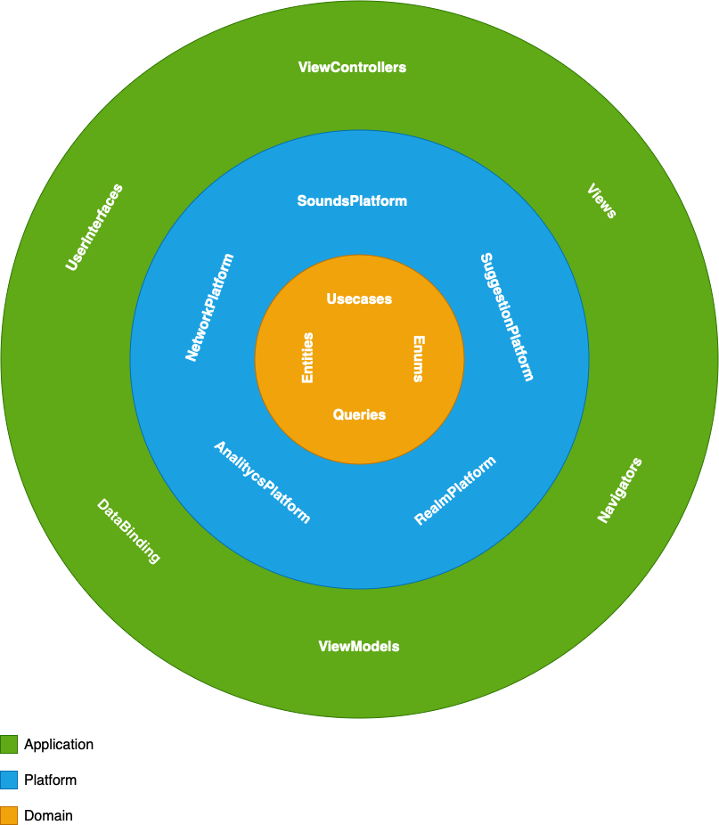
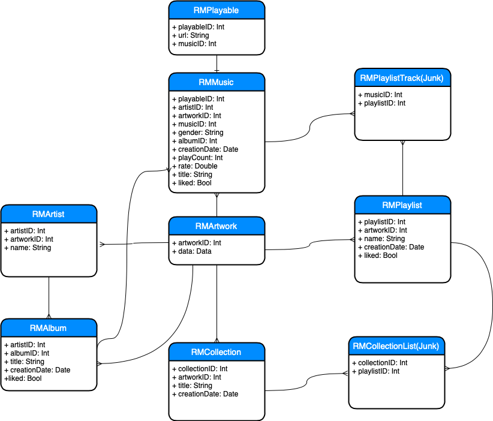

# Playor

## High level overview

## ERD

(This model naming is more suitable for mobile app projects.)

#### Domain 

The `Domain` is basically what is the App about and what it can do (Entities, UseCase etc.) **It does not depend on UIKit or any persistence framework**, and it doesn't have implementations apart from entities
Domain contains Protocols of eatch platform so there is no dependency between the platforms and they can work with eachother through the protocols.

#### Platform
The `Platform` is a concrete implementation of the `Domain` in a specific platform like iOS. It does hide all implementation details.

##### RealmPlatform
Provide an implementation of DataBase protocols defined in domain.

##### NetworkPlatform
Provide an implementation of features useCase protocols.

##### SuggestionPlatform
Works with database protocols and Provide an implementation of suggestion useCase protocols.
so the algorithm of creating playlists has no dependency to the dataBase platform 

##### SoundEngine
works only with playable models and provide infos about the AudioPlayerManager.

#### Application
`Application` is responsible for delivering information to the user and handling user input. It can be implemented with any delivery pattern e.g (in Playor is MVVMC). This is the place for `UIView`s and `UIViewController`s. As you will see from the app, `ViewControllers` are completely independent of the `Platform`.  The only responsibility of a view controller is to "bind" the UI to the Domain to make things happen.
